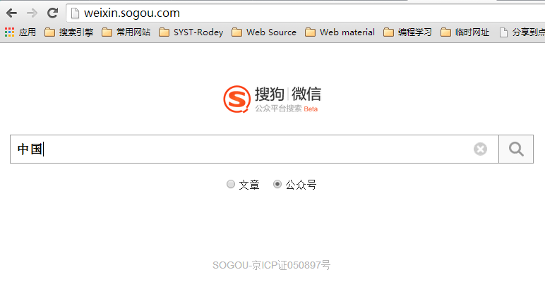

<h1>获取微信公众号信息</h1>

在搜狗中可以搜索微信公众号，并且可以获取对应公众号发布是文章

<pre>
	{
	  "name": "capture",
	  "version": "0.0.1",
	  "private": true,
	  "scripts": {
	    "start": "node ./bin/www"
	  },
	  "dependencies": {
	    "express": "~4.2.0",
	    "static-favicon": "~1.0.0",
	    "morgan": "~1.0.0",
	    "cookie-parser": "~1.0.1",
	    "body-parser": "~1.0.0",
	    "debug": "~0.7.4",
	    "jade": "~1.3.0",
	    "request":"2.33.0",
	    "xpath.js": "*",
	    "xmldom": "*",
	    "xml-digester": "*"
	  }

	}
</pre>

发送请求使用的是NodeJS request模块, 安装request模块:

<pre>
	npm install request
</pre>
request（GitHub）: <a href="https://github.com/mikeal/request" targe="_blank">https://github.com/mikeal/request</a>
 
 

搜狗中返回的列表中的item是一个xml文档，采用NodeJS的xml-digester模块解释, 安装: 

<pre>
	npm install xml-digester
</pre>
xml-digester（GitHub）: <a href="https://github.com/vrvolle/xml-digester" target="_blank">https://github.com/vrvolle/xml-digester</a>
 
 

前端解析item中的xml

<pre>
	var parseXML = function(data) {
		if ( window.DOMParser ) { // Standard
			tmp = new DOMParser();
			xml = tmp.parseFromString( data , "text/xml" );
		} else { // IE
			xml = new ActiveXObject( "Microsoft.XMLDOM" );
			xml.async = "false";
			xml.loadXML( data );
		}
		return xml.documentElement;
	}
</pre>

